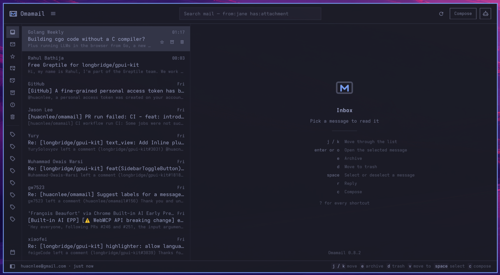
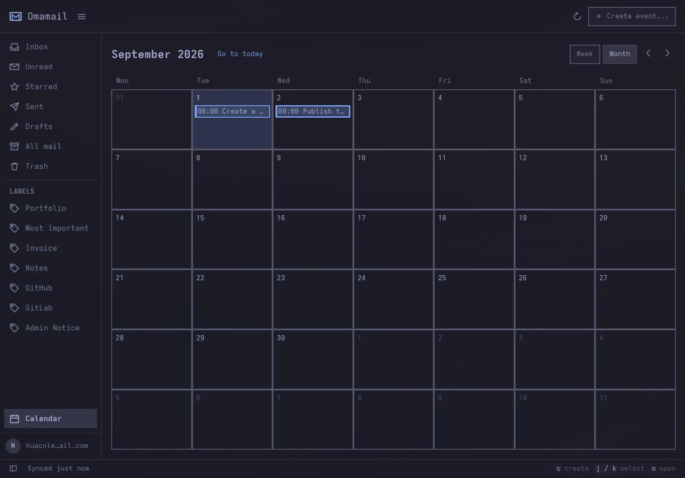
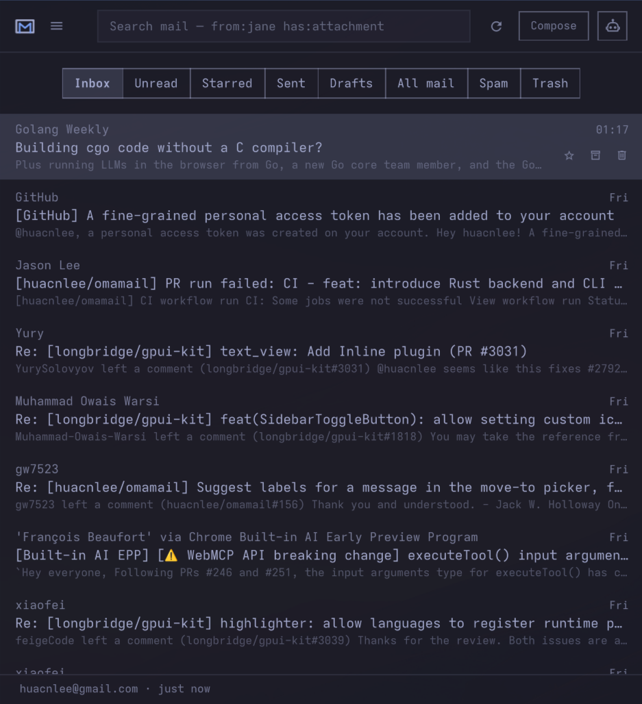

# Omamail

A native email and calendar app for Omarchy, with multiple accounts, keyboard navigation, AI assistance and your desktop theme.

## Install

Requires **Omarchy 4**.

```bash
omarchy plugin add https://github.com/huacnlee/omamail.git --enable
```

Update to new version:

```bash
omarchy plugin update omamail
```

Click the envelope in the bar, install the backend when prompted, and add your mailbox. Prebuilt backends are available for Linux x86_64 and aarch64.



## Features

- **Multiple mailboxes:** Gmail, Outlook, HEY, JMAP and IMAP/SMTP, including Fastmail, iCloud and self-hosted servers.
- **Mail and calendar:** read, search, compose, manage attachments and respond to meeting invitations. Available actions depend on your provider.
- **Keyboard navigation:** `j`/`k` to move, `r` to reply, `c` to compose, `/` to search and `?` for all shortcuts.
- **AI assistance:** ask about selected messages and review suggested drafts using your Omarchy AI setup. See [AI assistance](docs/AGENT.md).
- **Desktop integration:** theme matching, unread counts, notifications, `mailto:` links and a compact layout for smaller windows.
- **Privacy controls:** credentials stored in the system keyring and remote images blocked until you choose to load them.

  

## Add your mailbox

Choose a provider in Settings. Gmail needs a Google OAuth client; Outlook needs a Microsoft app registration. HEY uses the official [HEY CLI](https://github.com/basecamp/hey-cli). JMAP and IMAP usually use an app password or API token.

See [mailbox setup](docs/MAILBOXES.md) for provider instructions and limitations, including Microsoft 365 and Proton Mail Bridge.

## Open from the keyboard

Add this to `~/.config/hypr/bindings.lua`:

```lua
o.bind("SUPER + SHIFT + G", "Omamail", "omarchy shell shell toggle omamail '{}'")
```

Press `?` in Omamail for the shortcut sheet, or see the [keyboard guide](docs/KEYS.md).

## Help and contributing

- [Backend installation, updates and recovery](docs/BACKEND-RUNTIME.md)
- [Contributing](CONTRIBUTING.md)

Omamail is an independent project and is not affiliated with Google, Microsoft or 37signals. Gmail, Outlook and HEY belong to their respective trademark owners.

Licensed under the [MIT License](LICENSE).
