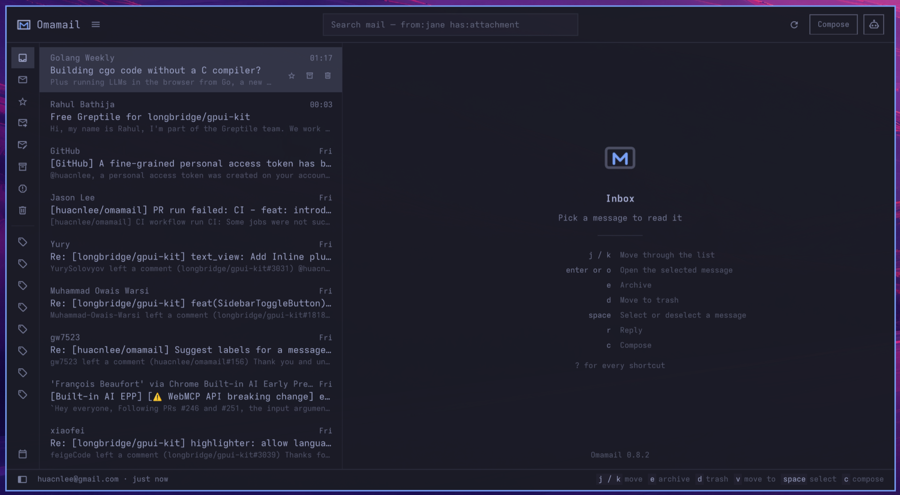
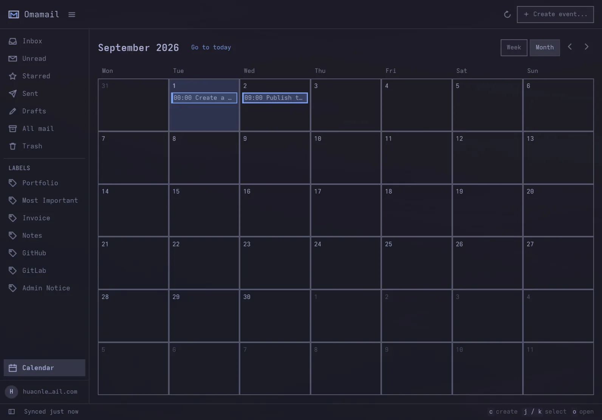
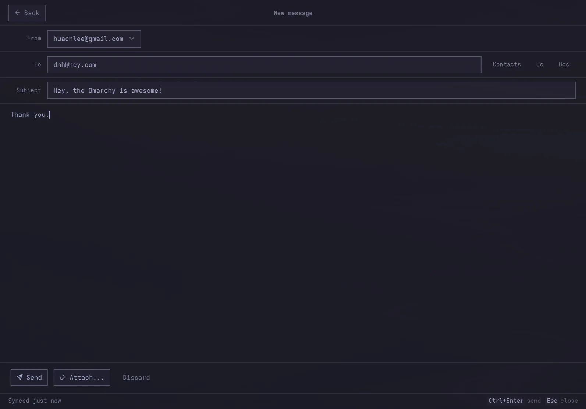
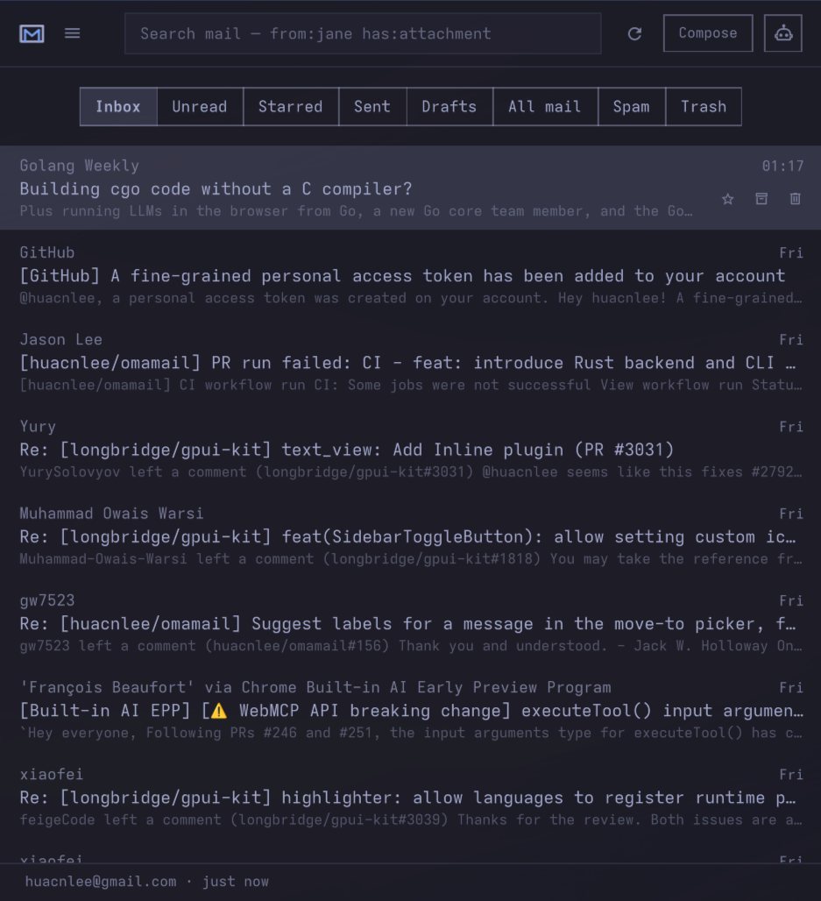

# Omamail

Omamail is a native email and calendar app with multiple accounts and keyboard navigation. It runs either as an Omarchy shell plugin or as a standalone Qt desktop application.



**If this helps you, please [sponsor me](https://github.com/sponsors/huacnlee).**

## Install

### Omarchy plugin

The plugin requires **Omarchy 4** and follows the active Omarchy theme. It includes the bar widget, `mailto:` integration, and AI assistance through the configured Omarchy agent.

```bash
omarchy plugin add https://github.com/huacnlee/omamail.git --enable
```

Update it with:

```bash
omarchy plugin update omamail
```

Click the envelope in the bar, install the pinned backend when prompted, and add your mailbox. Prebuilt plugin backends are available for Linux x86_64 and aarch64.

### Standalone desktop app

The standalone app includes mail, calendar, and native desktop notifications. It has no system tray, AI assistance, or operating-system `mailto:` registration in this release.

macOS & Linux:

```bash
curl -fsSL https://huacnlee.github.io/omamail/install.sh | sh
```

Windows (PowerShell):

```powershell
irm https://huacnlee.github.io/omamail/install.ps1 | iex
```

Each installer verifies the release package before replacing an existing version. The macOS app and Windows executable are unsigned. The macOS installer removes quarantine only after verifying the downloaded archive. See [standalone runtime and release details](docs/BACKEND-RUNTIME.md#standalone-bundled-backend) for package layout, platform integration, installer behavior, and security checks.

## Run from source

Install Rust, CMake 3.21 or newer, and Qt 6.5 or newer, then use the repository Make targets:

```bash
make app-run
```

`make app-run` builds the standalone backend and Qt host, then launches from the source resources. Current source builds enable AI assistance on Linux and macOS with an installed Claude, Codex or OpenCode CLI; choose the agent in Settings. Windows AI support remains deferred. See [Contributing](CONTRIBUTING.md) for validation commands.

## Features

- **Multiple mailboxes:** Gmail, Outlook, Microsoft 365, HEY, JMAP and IMAP/SMTP, including Fastmail, iCloud and self-hosted servers.
- **Mail and calendar:** read, search, compose, manage attachments and respond to meeting invitations. Available actions depend on your provider.
- **Keyboard navigation:** `j`/`k` to move, `r` to reply, `c` to compose, `/` to search and `?` for all shortcuts.
- **AI assistance in Omarchy:** ask about selected messages and review suggested drafts with Claude, OpenCode V2 or Codex. Follow your Omarchy default, or select an agent and optional model in Settings. An unsupported system default disables the AI action with a setup explanation. Conversations retain follow-ups and draft proposals; `/clear`, `/history` and `/diagnose` manage the chat.
- **Desktop integration:** native notifications and a compact layout for smaller windows; the Omarchy plugin also provides the bar widget and `mailto:` integration.
- **Privacy controls:** credentials stored in the system keyring and remote images blocked until you choose to load them.

  

## Add your mailbox

Choose a provider in Settings. Released builds of Gmail sign in with an included Google OAuth client, and you can use your own instead; Outlook and Microsoft 365 need a Microsoft app registration. HEY uses the official [HEY CLI](https://github.com/basecamp/hey-cli). JMAP and IMAP usually use an app password or API token.

See [mailbox setup](docs/MAILBOXES.md) for provider instructions and limitations, including Microsoft 365 and Proton Mail Bridge.

## Make Omamail the default mail client

Omarchy opens HEY's web app on `SUPER+SHIFT+E`. Choose **Settings → Default mail client → Set as default** to make Omamail open `mailto:` links, `SUPER+SHIFT+E`, and `SUPER+SHIFT+ALT+E` for a new message.

The key bindings go in a clearly marked block in `~/.config/hypr/bindings.lua`; Omarchy's own files are never changed. **Undo** removes the block and leaves the file as it was.

## Open the Omarchy plugin from the keyboard

To use another key, add this to `~/.config/hypr/bindings.lua`:

```lua
o.bind("SUPER + SHIFT + G", "Omamail", "omarchy shell shell toggle omamail '{}'")
```

Press `?` in Omamail for the shortcut sheet, or see the [keyboard guide](docs/KEYS.md).

## Help and contributing

- [Backend installation, updates, release flow, and recovery](docs/BACKEND-RUNTIME.md)
- [Contributing](CONTRIBUTING.md)

Omamail is an independent project and is not affiliated with Google, Microsoft or 37signals. Gmail, Outlook and HEY belong to their respective trademark owners.

Licensed under the [MIT License](LICENSE).

## More projects

- [Disktree](https://huacnlee.github.io/disktree/) — A native disk-space explorer for macOS and Linux. See what fills your disk as a nested treemap, and review every path before removing anything.
- [Omasend](https://huacnlee.github.io/omasend/) — A native LocalSend client. Share files, folders, screenshots, and text over your local network, with no account or cloud upload.
- [Noop](https://huacnlee.github.io/noop/) — Your own AI team. Claude Code and Codex agents on your own computers do the daily work and only ask when something really needs you.
- [huacnlee/cargo](https://huacnlee.github.io/cargo/) — A drop-in Cargo fork: every git worktree of a project shares one build directory, which stays under a size limit on its own.
- [omarchy-mihoro](https://github.com/huacnlee/omarchy-mihoro) — An Omarchy bar panel for Mihoro. Monitor your proxy, switch between Rule, Global, and Direct modes, and manage subscriptions.
- [omarchy-which-key](https://github.com/huacnlee/omarchy-which-key) — Which Key for the desktop. Hold Super to see a shortcut guide drawn from your active Omarchy and Hyprland keybindings.
